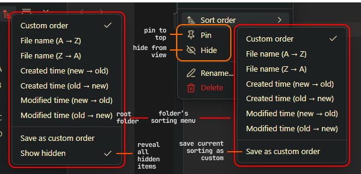

	<h1>🗃️ Flexplorer</h1>
	An Obsidian plugin that <b>enhances the native file explorer</b>
	  
	

		&nbsp;
		&nbsp;
		
	

	<b>
		<a href="#-features">Features</a>&nbsp; •&nbsp;
		<a href="#%EF%B8%8F-usage">Usage</a>&nbsp; •&nbsp;
		<a href="#-installation">Installation</a>&nbsp; •&nbsp;
		<a href="#-credits">Credits</a>
	</b>
	  
	

## 🔥 Features
- **Per-folder sorting:** each folder can use its own sorting mode
- **Custom order mode:** manually arrange items via drag-and-drop
- **Pinning & hiding:** keep important files at the top, hide irrelevant ones
- **Mobile support:** all features work on mobile as well

## 🕹️ Usage

#### Notes:
- To drag items on touch devices, hold them **by the right edge**

## 📥 Installation
- **Via the Obsidian Community**: https://community.obsidian.md/plugins/flexplorer
- **Using the [BRAT plugin](https://github.com/TfTHacker/obsidian42-brat)**: `Add Beta Plugin` → `kh4f/flexplorer`
- **Manually**: extract the [latest release](https://github.com/kh4f/flexplorer/releases/latest) `flexplorer-*.zip` into `vault/.obsidian/plugins/flexplorer/`

## 💖 Credits
- **Inspiration**: [Obsidian Bartender](https://github.com/Mara-Li/obsidian-bartender), [Custom File Explorer sorting](https://github.com/SebastianMC/obsidian-custom-sort), [File Explorer++](https://github.com/kelszo/obsidian-file-explorer-plus)
- **Huge thanks** to [@Zweikeks](https://github.com/Zweikeks), [@Azmoinal](https://github.com/Azmoinal), [@SublimePeace](https://github.com/SublimePeace), [@AE-SAY-WAY](https://github.com/AE-SAY-WAY), [@Anonym0usPlayer](https://github.com/Anonym0usPlayer) and others for testing and feedback!
- **Special thanks** to [@Mara-Li](https://github.com/Mara-Li) for contributions!